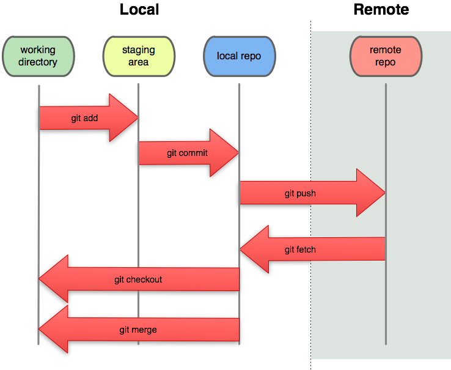

<div style="text-align: justify">

# Basic workflow

## What is git?

Git is a **version control system**, which is a tool that manages changes made
to the files and directories in a project. Git isn't just for programmers and engineers, any job that has versions that change over time can be managed with git.

Another advantage of git is that it eases collaboration, since its system is 
also able to integrate the work done by several people and keep the history of changes made by each collaborator. Git allows you to:

- Keep track of changes to files,
- Notice conflicts between changes made by different people,
- Synchronize files between different computers.

<center>

</center>

## Where does git store information?

Each of your git projects has two parts: the files and directories that you 
create and edit directly, and the extra information that git records about the 
project's history. The combination of these two things is called 
a **repository**.

Git stores all of its extra information in a directory called **`.git`** 
located in the root directory of the repository.

## Starting a repository

The command for starting a new repository, that is, telling Git that we want to use its version control system in our project, is **`git init`**. When running this command, the **`.git`** directory will be generated. A space known as "staging area" is also generated in RAM, which will temporarily save our files. 

## Adding files to the "staging area"

To indicate that we want to add a file to our repository, we use the 
**`git add filename`** command. This is the first step in saving our changes.

If you want to add all the files that have changed, you can use **`git add .`**
to avoid listing the name of all the files.

## How do I commit changes? store changes made to a file

Once the file we're working on is added to the staging area (with `git add`) and we've made the changes we want to make, the command to permanently store all the changes is **`git commit`**. It always saves everything that is in the staging area as one unit. 

When you commit changes, git requires you to enter a **log message**. This serves the same purpose as a comment in a program: it tells the next person to examine the repository why you made a change. The `-m` flag comes in handy for this purpose.

`git commit -m "This is a comment about the changes made"`

If you accidentally mistype a commit message, you can change it using the `--amend` flag.

`git commit --amend - m "new message"`

<center>

</center>

We have already explained that the **staging area** is the space in which git stores files with changes you want to save, but that haven't been saved yet.
Putting files in the staging area is like putting things in a box, while **committing** those changes is like putting that box in the mail: you can add more things to the box or take things out as often as you want, but once you put it in the mail, you can't make further changes.

## How can I check the state of a repository?

When you are using git, you will frequently want to check the status of your 
repository. To do this, run the command **`git status`**, which displays a list 
of the files that have been modified since the last time changes were saved.

```{bash, eval=FALSE, include=FALSE}

danae:~/Documents/Git/DanaeMirel.github.io$ git status 
On branch master
Your branch is ahead of 'origin/master' by 1 commit.
  (use "git push" to publish your local commits)

nothing to commit, working tree clean

```

`git status` shows you which files are in this staging area, and which files have changes that haven't yet been put there. 

In order to compare the file as it currently is to what you last committed, you can use `git diff filename`. 

The command `git diff` without any file names will show you all the changes in your repository, while `git diff directory` will show you the changes to the 
files in some directory.