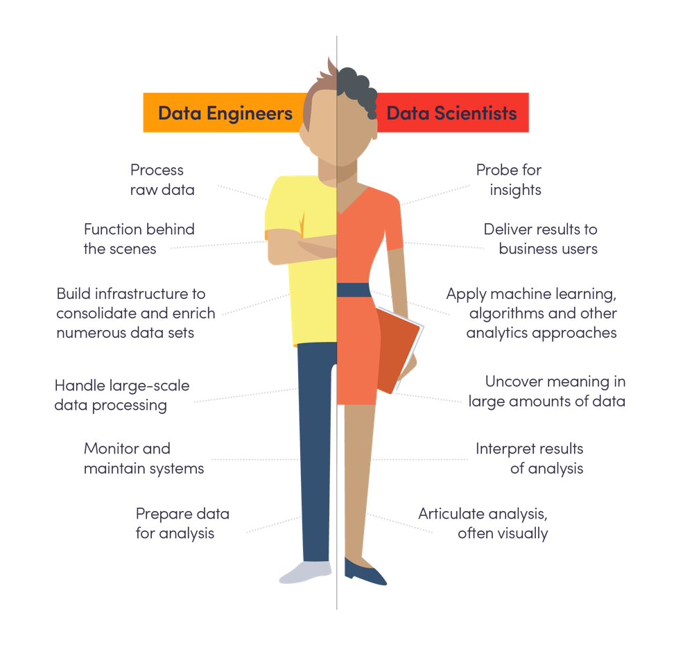

## Index 
1. What is data science? 
2. What kind of problems can be solved with data science?
3. The data science workflow
4. Data science related roles

### 1. What is data science? 

Data science is a set of methodologies for processing and studying data. The 
goal is to use this data to draw meaningful conclusions. For instance, thanks to 
insights coming from data transactions, we could make an effective detection and 
prevention of fraud involving credit cards. 

### 2. What kind of problems can be solved with data science?

More precisely, data scientists can use data to:

- Describe the **current state** of an organization or process
- Detect **anomalous** events, such as fraudulent transactions
- Diagnose the **causes** of observed events and behaviors 
- Predict **future** events 

Data science is about discovering and communicating insights from data, which is 
coming from very different sources, so in order to exploit it, data scientists 
need to adopt a specific workflow.

### 3. The data science workflow

1. *Problem Statement*. Establish a well defined question.

2. *Data collection and storage*. Fist we collect data from many sources, such 
as surveys and financial transactions and then, we store that data in a safe and 
accessible way.   

3. *Data preparation*. This step includes the cleaning, for instance finding 
missing or duplicate values and converting data into a more organized format.

4. *Exploration and visualization*. This can involve building dashboards, track 
how the data changes over time or performing comparisons. 

5. *Experimentation and predictions*. This could include building forecasting 
systems and trying different machine learning algorithms in order to compare their 
effectiveness on the data. 

### 4. Data science related roles

There is not a single job within the data science world. Generally, there are 
four main roles: 

- **Data engineer**

Data engineers control the flow of data: they build custom data pipelines and 
storage systems. They design infrastructure so that data is not only collected, 
but easy to obtain and process. 

Data engineers are proficient in SQL, which they use to store and organize data. 
They need to be comfortable with cloud computing to ingest and store large 
amounts of data.  

- **Data analyst**

Data analysts perform simpler analysis that describe data. They do this by 
exploring the data and creating visualizations and dashboards.  

Analyst also use Business Intelligence tools such as Tableau and Power BI, to 
create dashboards and share their analyses. 

- **Data scientist** 

Data scientist have a strong background in statistics, enabling them to find new 
insights from data, rather than solely describing data. The also use traditional 
machine learning for prediction and forecasting. Data scientist must be 
proficient in Python or R.

- **Machine Learning scientist**

They go beyond traditional machine learning with deep learning. Machine learning 
scientist use either R or Python to create their predictive models. 

 {width=700px}
<!--  -->

### Other resources and references 

1. [Data Science Workflow](https://www.zeolearn.com/magazine/data-science-workflow)
2. [Top 9 data science use cases in banking](https://www.fintechnews.org/top-9-data-science-use-cases-in-banking/)
3. [Data Analyst vs Data Engineer vs Data Scientist: Skills, Responsibilities,
Salary](https://www.edureka.co/blog/data-analyst-vs-data-engineer-vs-data-scientist/)
4. [Data Science for Everyone](https://learn.datacamp.com/courses/data-science-for-everyone)