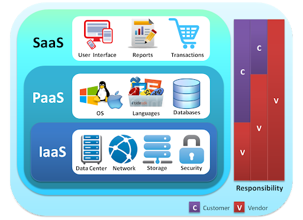

## What exactly is the cloud and why is everyone rushing to adopt it?

You may have heard of the cloud in the context of storing your photos and videos online, but cloud computing is more than that. It is part of a business model that is becoming increasingly popular with more and more companies moving their workloads to the cloud.

Cloud computing is the delivery of technology services (including compute, storage, databases, networking, software) over the internet with *pay as you go* pricing. Other popular uses of the cloud include:

- Store, back up, and recover data
- Create cloud-native applications
- Stream audio and video (such as Netflix does)
- Deliver software on demand
- Analyze data
- Embed artificial intelligence models

 {width=500px}
 <!-- {width=500px} -->

### Cloud vs. on-premise

The cloud is transforming the way organizations use computer services. Where in the past you had to own local servers and systems, in the cloud they are managed by an external provider that charges you for the use.

The cloud is more scalable as you can easily add or release cloud resources. Compare to on-premise, it also has a fasten set-up speed. Lastly, the billing is more flexible in the cloud since you only pay for what you use. However, the best approach depends on your use case. There are situations in which an on-premise server is cheaper or more secure.      

### Primary cloud services

Cloud providers like AWS, Microsoft Azure, and Google Cloud offer a wide variety of services. The three basic ones, which you will be able to find for every cloud provider, are:

- Compute - provide the brains to process your workload
- Storage - save and store data
- Databases - store more structured sets of data

Nevertheless, the services offered by cloud providers cover a wide variety of areas and they are expanding continuously. 

### Key characteristics

Cloud computing services provide more possibilities for organizations all over the world. These services share certain characteristics that make them very powerful. Some of them are: 

1. Virtualization - is the technology that powers cloud computing. It consist in splitting the physical servers into multiple virtual servers, allowing for efficient use of the physical resources available.

2. Scalability - it refers to the possibility to add and remove resources as you need them.
3. Cost - You only pay for resources when you are using them.
4. Speed - You can have immediate access to ready-to-go cloud resources, this is called On-demand resourcing.
5. Performance - In the cloud, you can access to fast and efficient computing resources, including hardware.
6. Growth - The cloud enables growth using the wide range of resources and services offered. 
7. Reliability - The durability and availability of data and services is guaranteed, since data is duplicated across data centers.
8. Security - Secure storage and management of your data is also guaranteed. Nevertheless it stills been particularly risky for businesses in highly regulated sectors. 

### Cloud service models

Cloud computing is offered in three different service models each satisfying a unique set of business requirements. It's important to understand what each model offers. There are three main service models:

- Infrastructure as a Service (IaaS) - you *rent* the blocks of computing. It is the cloud-based alternative to on-premise infrastructure. 

- Platform as a Service (PaaS) - offers infrastructure and software for application development

- Software as a Service (SaaS) - offers *ready to use* applications in the cloud accessed by the user via a web browser or an app.  

Over the past years more and more functionality is being abstracted away from the end user, and offered as a cloud service package.

 {width=500px}
<!-- {width=500px} -->

<!-- ### Cloud computing roles -->

<!-- The rise of cloud computing has brought on a new wave of technology roles. Some of them include:  -->

<!-- - Cloud architect - Design cloud infrastructure for a given business problem -->
<!-- - Cloud engineer - Build, maintain and monitor clouds ervices -->
<!-- - DevOps engineer - Software **Dev**elopment + IT **Op**erations -->
<!-- - Security engineer - Test and assess security of data on the cloud -->

