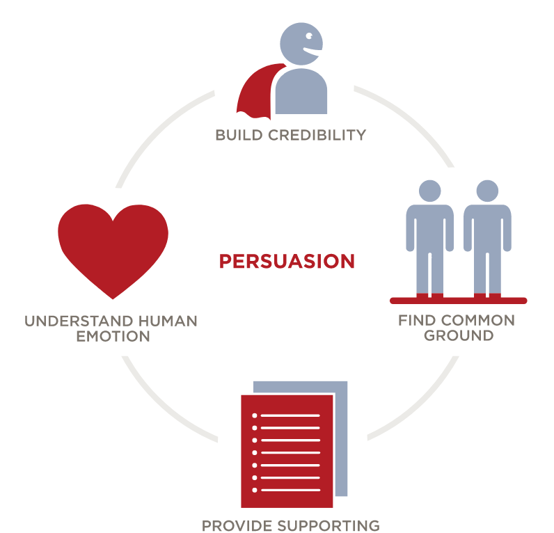

## Index

- Introduction  
- Elements of persuasion
- References
  
## 1. Introduction 

Persuading others is an essential communication skill. No one can achieve important goals on their own. Your success relies on your capacity to persuade others to align with your vision. Effective persuaders have the power to capture an audience, convince others to see things from their perspective and convert opponents to their cause. 

Persuasion is a critical skill because you need to use it frequently, in many different situations, and with a variety of individuals. 

## 2. Elements of persuasion

To persuade others, you need to position your idea in a way that appeals to the people affected by it. To do so, you have to make a rational case for your position using facts, expert opinions, and actual examples.

But you also need to present information in a way that appeals to their basic human emotions, such as the desire to be a team player or the passion to succeed.

To do all this, you need to master the elements of persuasion:
  

<!-- {width=500px} -->
{width=500px}

  
- [**Build credibility**](https://blogdanae.netlify.app/2021/03/26/build-credibility/). By earning others’ trust and establishing your expertise.

- **Find common ground**. Describe the benefits of the position you’re advocating in terms of what you and others value — such as increased revenues that could fund initiatives important to your department and others.

- **Provide supporting information**. Reinforce your position with compelling data, stories, examples, and images.

- **Understand human emotion**. Understand the people you want to persuade, and connect with them on an emotional level.

Effective persuaders have the power to:

1. Capture an audience
2. Sway others' opinions
3. Convince others to see things from their perspective
4. Get others to support their ideas
5. Convert opponents to their cause

## 3. References

[Persuading Others](https://edls.myhbp.org/hmm12/content/persuading_others/landingpage.html)

[**See next post:** Build your credibility](https://blogdanae.netlify.app/2021/01/15/build-credibility/)